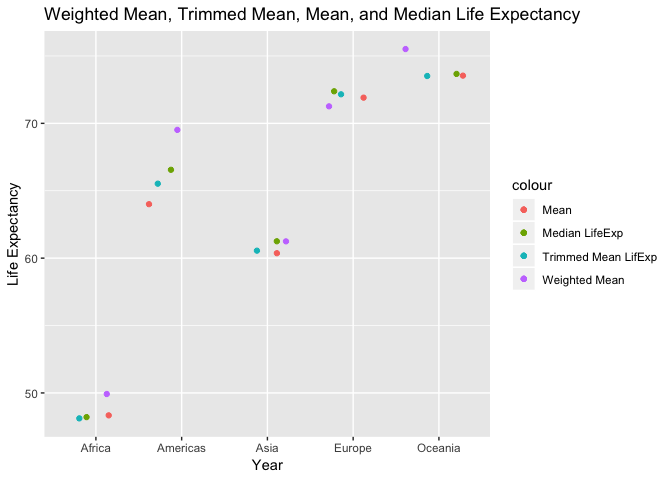

hw03.Rmd
================
Gurjot Singh
01/10/2018

# Homework 3 - singhg53

Hello and welcome to my Rmd file for homework \#3. Today we will be
exploring the `tidyverse` package, specifically `ggplot2` and `dplyr`
packages using the `gapminder` dataset.

First lets load the dataset, `gapminder` and the `tidyverse` package
which has `dplyr` the data manipulation tool and `ggplot2` the data
visualization tool.

``` r
suppressPackageStartupMessages(library(tidyverse))
suppressPackageStartupMessages(library(gapminder))
```

Now let’s analyze some
data.

# Task 1

#### For our first task we will: **Get the maximum and minimum of GDP per capita for all continents.**

First lets assign the minimum and maximum GDP per capita, grouped by
continents, to variable `GDPcont`. For ease of understanding I will be
defining some functions as we go along. The `group_by()` is **used to
take an existing tbl and converts it into a grouped tbl where operations
are performed.**

``` r
GDPcont <- gapminder %>%
  group_by(continent) %>% #organized by continent
  summarize(min = min(gdpPercap), max = max(gdpPercap)) #defining the min and max for gdpPercap

knitr::kable(GDPcont)
```

| continent |        min |       max |
| :-------- | ---------: | --------: |
| Africa    |   241.1659 |  21951.21 |
| Americas  |  1201.6372 |  42951.65 |
| Asia      |   331.0000 | 113523.13 |
| Europe    |   973.5332 |  49357.19 |
| Oceania   | 10039.5956 |  34435.37 |

The `knitr::kable` function is useful to make our tables more
asethetically pleasing.

Now let’s create some plots using the `ggplot2` data visualization tool.
For the first plot we will look at the minimum GDP per capita for each
continent.

``` r
ggplot(GDPcont, aes(continent, min)) + 
  geom_bar(stat = "identity", color = "red", fill = "red") + 
  scale_y_log10() + #this applies a log scale on the y-axis
  ggtitle("Minimum GDP per Capita for Each Continent") + #this adds a title to the graph
  ylab("Minimum GDP per Capita") + #this labels the y-axis
  xlab("Continent") #this labels the x-axis
```

<!-- -->

We can do the same for the maximum GDP per capita values for each
continent:

``` r
ggplot(GDPcont, aes(continent, max)) + 
  geom_bar(stat = "identity", color = "green", fill = "green") + 
  ggtitle("Maximum GDP per Capita for Each Continent") + 
  ylab("Maximum GDP per Capita") +
  xlab("Continent")
```

<!-- -->

# Task 2

#### Look at the spread of GDP per capita within the continents.

Violin plots are great to visualize the spread of the data. Below we
have used continent as the x-variable, whereas we used gdpPercap, as the
y-variable. The alpha value is specificed to 0.1 and can tell us
visually the density of each point.

``` r
ggplot(gapminder, aes(continent, gdpPercap, fill=continent)) + 
  scale_y_log10() +
  geom_violin() +
  geom_boxplot() +
  geom_jitter(alpha=0.1) +
  labs(title="Violin Plot of GDP per Capita for Each Continent") +
  ylab("GDP per Capita") +
  xlab("Continent")
```

<!-- -->

# Task 3

#### Compute a trimmed mean of life expectancy for different years. Or a weighted mean, weighting by population.

For this task we need to use the `trim` function. `trim` is essentially
used to trim the data to a certain specificed value. For example if we
set the trim to 0.16, it will cut off 16% of the data from the bottom
and top of the data. Interestingly, this would mean that the data would
represent the mean of one standard deviation if the trim is set to 0.16.

Below we created a new dataset called `trimmed_mean`. The data was piped
from `gapminder`, grouped by the year, and summarized into two other
variables Untrimmed Mean LifeExp (regular mean for each continent) and
TrimmedMeanLifExp.

``` r
trimmed_mean <- gapminder %>% group_by(year) %>% summarize("Untrimmed Mean LifeExp" = mean(lifeExp), TrimmedMeanLifExp = mean(lifeExp,trim = 0.16)) %>% arrange(year)

trimmed_mean
```

    ## # A tibble: 12 x 3
    ##     year `Untrimmed Mean LifeExp` TrimmedMeanLifExp
    ##    <int>                    <dbl>             <dbl>
    ##  1  1952                     49.1              48.1
    ##  2  1957                     51.5              51.0
    ##  3  1962                     53.6              53.4
    ##  4  1967                     55.7              55.8
    ##  5  1972                     57.6              58.1
    ##  6  1977                     59.6              60.3
    ##  7  1982                     61.5              62.3
    ##  8  1987                     63.2              64.3
    ##  9  1992                     64.2              65.6
    ## 10  1997                     65.0              66.5
    ## 11  2002                     65.7              67.3
    ## 12  2007                     67.0              68.7

We will now go ahead and plot the trimmed mean lifeExp for each year.

``` r
ggplot(trimmed_mean, aes(year, TrimmedMeanLifExp)) +
  geom_point(colour = "blue") +
  geom_smooth(colour = "light blue")
```

    ## `geom_smooth()` using method = 'loess' and formula 'y ~ x'

<!-- -->

Another intersting function we could use is `weighted.mean()`. Weighted
mean is a kind of average, however, some variables can contribute more
weight to specific numbers. In this example we use the weighted mean of
lifeExp and population
together.

``` r
weightedmean_lifeExp <- gapminder %>% group_by(year) %>% summarize("Mean" = mean(lifeExp), weightedmean = weighted.mean(lifeExp, pop))

weightedmean_lifeExp
```

    ## # A tibble: 12 x 3
    ##     year  Mean weightedmean
    ##    <int> <dbl>        <dbl>
    ##  1  1952  49.1         48.9
    ##  2  1957  51.5         52.1
    ##  3  1962  53.6         52.3
    ##  4  1967  55.7         57.0
    ##  5  1972  57.6         59.5
    ##  6  1977  59.6         61.2
    ##  7  1982  61.5         62.9
    ##  8  1987  63.2         64.4
    ##  9  1992  64.2         65.6
    ## 10  1997  65.0         66.8
    ## 11  2002  65.7         67.8
    ## 12  2007  67.0         68.9

The trimmed mean graph wasn’t that useful because we weren’t able to
combine different data. Below we combine the mean, trimmed mean lifeExp
(where trim = 0.16), and the weighted average
together.

``` r
combineddata <- gapminder %>% group_by(year) %>% summarize( Mean = mean(lifeExp), weightedmean = weighted.mean(lifeExp, pop), TrimmedMeanLifExp = mean(lifeExp,trim = 0.16))

combineddata
```

    ## # A tibble: 12 x 4
    ##     year  Mean weightedmean TrimmedMeanLifExp
    ##    <int> <dbl>        <dbl>             <dbl>
    ##  1  1952  49.1         48.9              48.1
    ##  2  1957  51.5         52.1              51.0
    ##  3  1962  53.6         52.3              53.4
    ##  4  1967  55.7         57.0              55.8
    ##  5  1972  57.6         59.5              58.1
    ##  6  1977  59.6         61.2              60.3
    ##  7  1982  61.5         62.9              62.3
    ##  8  1987  63.2         64.4              64.3
    ##  9  1992  64.2         65.6              65.6
    ## 10  1997  65.0         66.8              66.5
    ## 11  2002  65.7         67.8              67.3
    ## 12  2007  67.0         68.9              68.7

Now since we have our dataset, `combineddata`, we could go ahead and
plot it below.

``` r
combineddata %>% 
  ggplot(aes(year)) +
  geom_line(aes(y = weightedmean, colour = "Weighted Mean")) +
  geom_line(aes(y = TrimmedMeanLifExp, colour = "Trimmed Mean LifExp")) +
  geom_line(aes(y = Mean, colour = "Mean")) +
  ylab("Life Expectancy") +
  xlab("Year") +
  ggtitle("Mean LifeExp, Trimmed Mean LifeExp, and Weighted Mean LifeExp vs. Year")
```

<!-- -->

It is interesting to note that the weighted lifeExp goes down from both
the trimmed mean and the normal mean of the data. This indicates that
the weighted average of the population went down as a function of the
lifeExp.

# Task 4

#### How is life expectancy changing over time on different continents?

We can look at the lifeExp over time below by grouping both the
continent and year. The mean is the lifeExp for all the different
countries.

``` r
lifeExp_overtime<- gapminder %>% group_by(continent, year) %>% summarize("Mean" = mean(lifeExp))

lifeExp_overtime
```

    ## # A tibble: 60 x 3
    ## # Groups:   continent [?]
    ##    continent  year  Mean
    ##    <fct>     <int> <dbl>
    ##  1 Africa     1952  39.1
    ##  2 Africa     1957  41.3
    ##  3 Africa     1962  43.3
    ##  4 Africa     1967  45.3
    ##  5 Africa     1972  47.5
    ##  6 Africa     1977  49.6
    ##  7 Africa     1982  51.6
    ##  8 Africa     1987  53.3
    ##  9 Africa     1992  53.6
    ## 10 Africa     1997  53.6
    ## # ... with 50 more rows

The plot below gives us great information on the general trend of where
the data is going. For example, by using the plot below we could
visually tell which continent has the highest lifeExp (Oceania).
Moreover, we could tell that life expectancy in Africa starts to plateau
between the year 1980-1990.

``` r
  ggplot(gapminder, aes(x = year, y = lifeExp, colour = continent)) +
  geom_point(alpha=0.3) +
  geom_smooth() +
  ylab("Life Expectancy") +
  xlab("Year") +
  ggtitle("Life Expectancy Changing Over Time on Different Continents")
```

    ## `geom_smooth()` using method = 'loess' and formula 'y ~ x'

<!-- -->

# Task 5

Let’s take on an additional task for fun. In this task we will be
combining more data together but unlike what we did before we will be
grouping it by different continents. First lets set `combineddata2`. In
this dataset we will use mean of lifeExp, weighted mean, trimmed mean,
and let’s introduce a new variable for the first time the, `median`
function.

``` r
combineddata2 <- gapminder %>% group_by(continent) %>% summarize(Mean = mean(lifeExp), weightedmean = weighted.mean(lifeExp, pop), TrimmedMeanLifExp = mean(lifeExp,trim = 0.16), medianlifeExp= median(lifeExp))

combineddata2
```

    ## # A tibble: 5 x 5
    ##   continent  Mean weightedmean TrimmedMeanLifExp medianlifeExp
    ##   <fct>     <dbl>        <dbl>             <dbl>         <dbl>
    ## 1 Africa     48.9         50.6              48.1          47.8
    ## 2 Americas   64.7         69.5              65.9          67.0
    ## 3 Asia       60.1         61.1              61.0          61.8
    ## 4 Europe     71.9         72.3              72.4          72.2
    ## 5 Oceania    74.3         75.5              74.1          73.7

We will now go ahead and plot these different values onto a graph.

``` r
ggplot(combineddata2, aes(continent)) +
  geom_jitter(aes(y = weightedmean, colour = "Weighted Mean")) +
  geom_jitter(aes(y = TrimmedMeanLifExp, colour = "Trimmed Mean LifExp")) +
  geom_jitter(aes(y = Mean, colour = "Mean")) +
  geom_jitter(aes(y = medianlifeExp, colour = "Median LifeExp")) +
  ylab("Life Expectancy") +
  xlab("Year") +
  ggtitle("Weighted Mean, Trimmed Mean, Mean, and Median Life Expectancy")
```

<!-- -->

The information above can tell us a lot. We could look at the average
lifeExp over the years this data is collected and we can tell that
Oceania has consistently ranked at the top. We can also tell the spread
of the data for Asia is quite prominent since both the mean and median
are quite seperated.

# Thank-you for visiting my page\!
